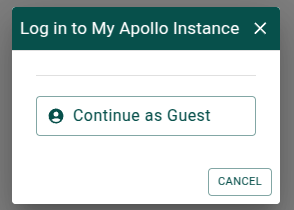

# Setting up the environment

The environment in GitHub Codespaces has already been set up with all the
components needed to run JBrowse and Apollo. In particular, the components that
Apollo needs to run are:

- JBrowse
- The Apollo JBrowse plugin
- The Apollo Collaboration Server
- A database

You can read more about these components
[in the Apollo docs](https://apollo.jbrowse.org/docs/getting-started/deployment/background),
and there is a detailed description of what was needed to install and configure
all these components in the [text](07-appendix-setting-up-apollo.md)appendix of
this workshop.

Please note that although this Codespaces environment is set up using a
Dockerfile, the commands that were run to set it up are meant to emulate what
would be needed to set up Apollo on a standard Ubuntu server. If you would like
to use Docker to deploy Apollo, we suggest not using a Dockerfile like the one
included here and instead use Docker Compose \
[as described in the Apollo Docs](https://apollo.jbrowse.org/docs/getting-started/deployment/deployment-examples/docker-compose).

## Starting the services

We will need to run a couple commands to start the services. In a terminal in
Codespaces, please run

```sh
sudo service apache2 start
sudo service mongod start
```

to ensure that the Apache server and MongoDB database are running.

We'll now need to configure and start the Apollo Collaboration Server. Run

```sh
cd ~/Apollo/packages/apollo-collaboration-server/
code .env
```

This will open the an environemnt file in your editor that contains the
configuration for Apollo. You can find out more about the available
configuration options in the
[Apollo docs](https://apollo.jbrowse.org/docs/getting-started/deployment/configuration-options).

In the first line of the file, replace `<forwarded address>` with the forwarded
address you got when
[forwarding a port](./00-introduction.md#github-codespaces) during the setup (or
<http://localhost:27655> if you're not using Codespaces) in your browser. Save
the file, and then in the teriminal run

```sh
yarn start:prod
```

Open the forwarded address (or <http://localhost:27655> if you're not in
Codespaces) in your browser. Open an "Empty" session, and then choose "Continue
as Guest" in the dialog that appears.



Congratulations, Apollo is now ready to use!
