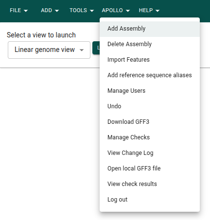
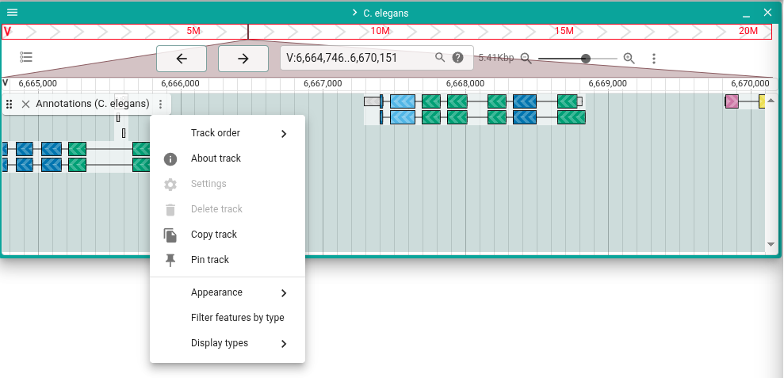
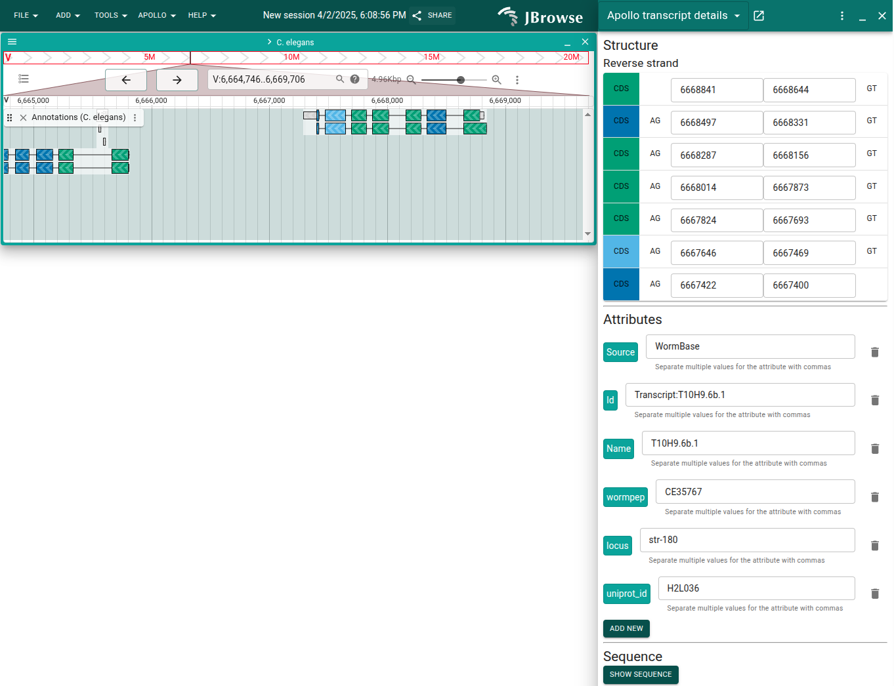

# Exploring the Apollo UI

You'll access the functionality of Apollo in JBrowse in two main ways. The first
is through various menus, and the second is through the Apollo annotations
track.

## Menu options

The first menu to be aware of is the "Apollo" menu in the app bar at the top of
the app. Several of these entries do the same things we used the Apollo CLI for,
like adding assemblies and features.

Apollo also adds some new menu items to other JBrowse tracks. For example, in a
JBrowse gene track, you can right-click a gene and select "Create Apollo
annotation".

## Apollo track

Apollo adds a track for each assembly to JBrowse with the annotations that have
been loaded.

When you open this track, you'll see the annotations graphically. There is a
track menu with various options for changing the appearance of the track.

When you right-click on a feature in the track, you can bring up a side drawer
display for seeing more details about a feature and editing its structure or
functional information.

Now we can move on to adding some JBrowse evidence tracks in order to add
support for our annotations.
