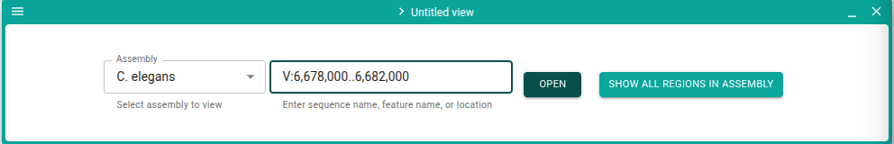
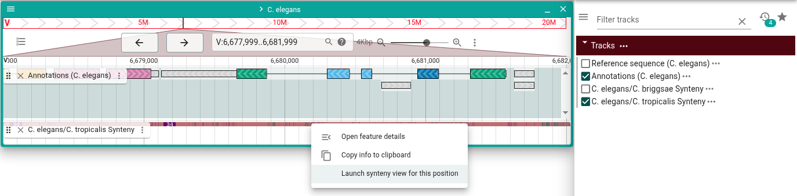
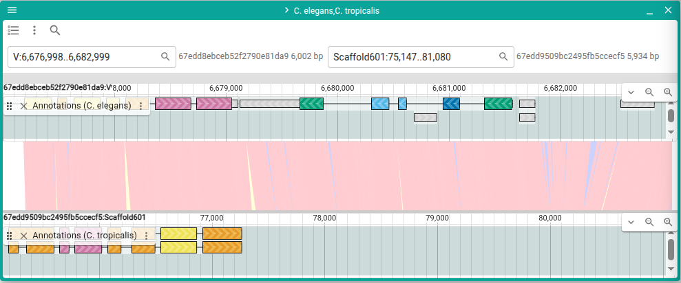
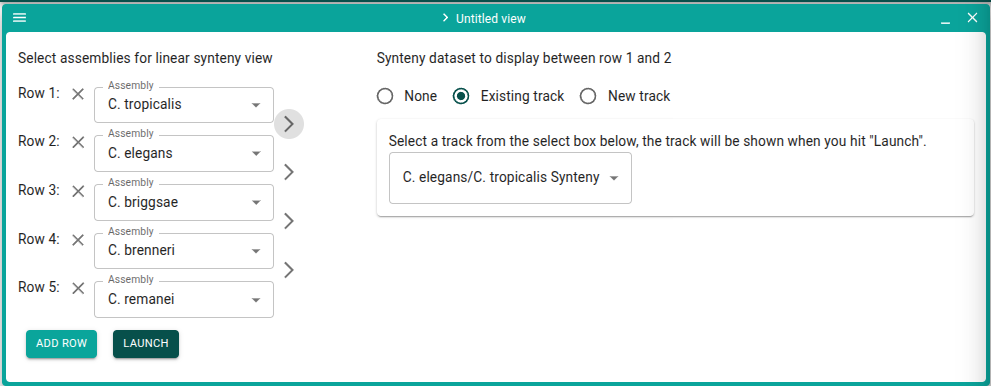
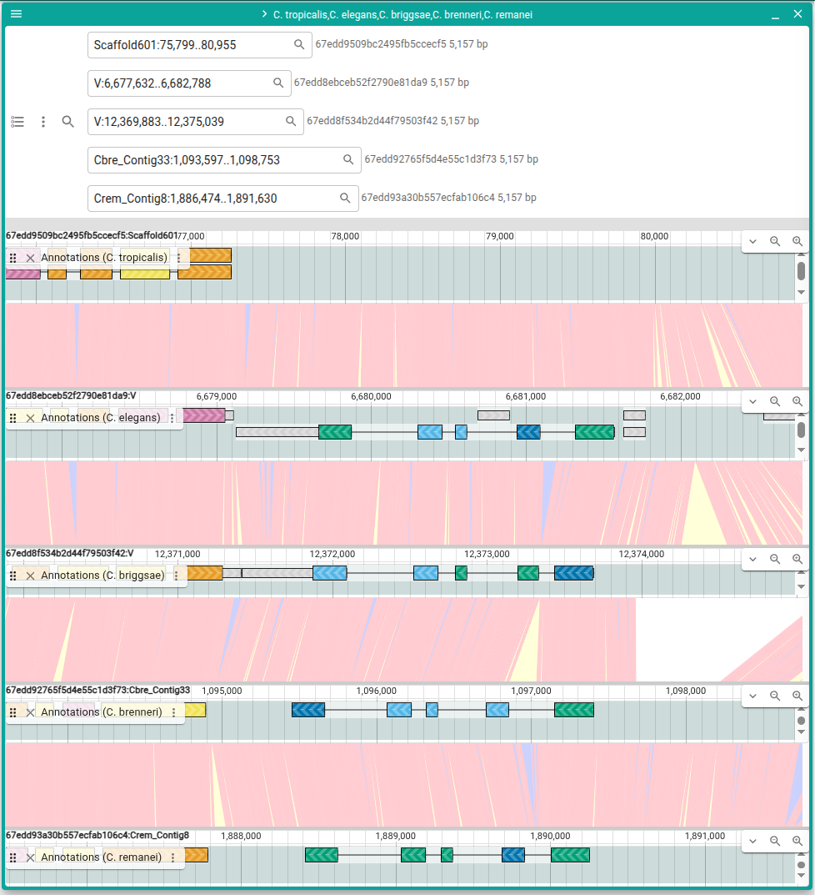

# Exploring JBrowse

## Synteny

Let's look at an example of the uses of synteny tracks in JBrowse and Apollo. In
JBrowse, launch a linear genome view and select "C. elegans" as the assembly. In
the box next to the assembly, enter the region `V:6,678,000..6,682,000` and
click "Open". (You can also click "Open" without putting anything in the second
box and navigate to that region later by putting it in the search box of the
linear genome view)

Click "Open track selector" and open the "Annotations (C. elegans)" and "C.
elegans/C. tropicalis Synteny" tracks by checking them.

In the synteny track, you can see there is a synteny relationship. Right-click
on the feature in the synteny track and choose "Launch synteny view for this
position". Leave the defaults in the dialog that pops up and select "Submit".

You can now see the _C. elegans_ assembly on the top and the _C. tropicalis_
assembly on the bottom. If you open the annotations track on both views, you'll
see that it looks like _C. tropicalis_ is missing the "egl-46" gene[^1].

Now let's confirm with other organisms, let's close the views we already have
and select "Add -> Linear synteny view" from the menu. Click the "Add row"
button three times to get a total of five rows, and then select the assemblies
in this order:

1. _C. tropicalis_
2. _C. elegans_
3. _C. briggsae_
4. _C. brenneri_
5. _C. remanei_

Click on each of the `>` Arrows between to rows to make sure the tracks are
showing up correctly. Then click "Launch".

To naviagate to a particular area, click the search button and select "Show
search boxes".

Since we know the name of the missing gene is "egl-46", we can search for that
in each of the boxes. Or if you have a list of regions you can use those in
the search boxes as well. For example, for our gene of interest:

1. `Scaffold601:75,799..80,955`
2. `V:6,677,632..6,682,788`
3. `V:12,369,883..12,375,039`
4. `Cbre_Contig33:1,093,597..1,098,753`
5. `Crem_Contig8:1,886,474..1,891,630`

[^1]:
    Missing gene originally noted in <https://doi.org/10.1186/s12864-024-10919-6>
