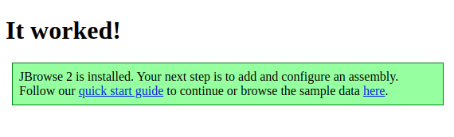
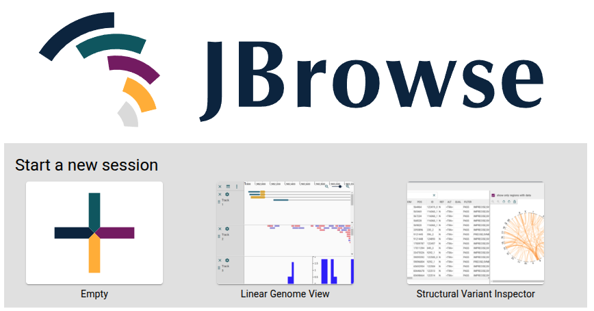
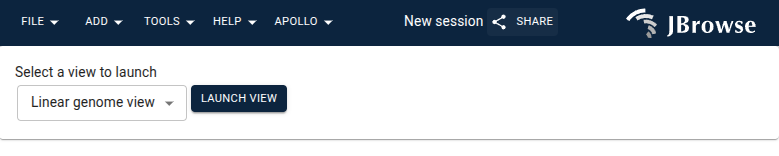
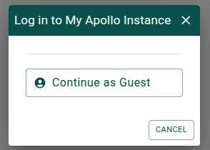

# Setting up Apollo

A full installation of Apollo involves four components:

- JBrowse
- The Apollo JBrowse plugin
- The Apollo Collaboration Server
- A database

You can read more about these components
[in the Apollo docs](https://apollo.jbrowse.org/docs/getting-started/deployment/background).

## Set up JBrowse

Before installing anything, just to make sure the repositories are up to date,
run

```sh
sudo apt update
```

This next part is technically optional, but will avoid a bunch of verbose
warnings when installing tools later. These steps would likely be unnecessary on
a non-Docker Ubuntu server, since they are usually set during the OS
installation, but Docker images tend to have the bare minimum installed and
configure.

```sh
sudo ln -s /usr/share/zoneinfo/America/Chicago /etc/localtime
sudo apt install -y locales tzdata
sudo sed -i '/en_US.UTF-8/s/^# //g' /etc/locale.gen
sudo locale-gen
```

Now install the tools we need by running

```sh
sudo apt install -y apache2 curl unzip
```

This installs:

- apache2, which is the web server we'll use to server JBrowse
- curl, for fetching the JBrowse installation files from the web
- unzip, for decompressing the JBrowse installation files

By default, apache2 serves files located in the `/var/www/html` directory. We'll
add permissions for our user to access that directory and then set up the
JBrowse files there.

```sh
sudo chown -R $(whoami) /var/www/html/
cd /var/www/html/
rm index.html
curl -fsSL https://github.com/GMOD/jbrowse-components/releases/download/v3.2.0/jbrowse-web-v3.2.0.zip > jbrowse-web.zip
unzip jbrowse-web.zip
rm jbrowse-web.zip
sudo service apache2 start
```

Now open the forwarded address you got when
[forwarding a port](./00-introduction.md#github-codespaces) during the setup (or
<http://localhost:27655> if you're not using Codespaces) in your browser. You
should see a screen that says "It worked!". If so, JBrowse has been successfully
installed.



## Set up Apollo JBrowse plugin

To add the Apollo plugin, we'll first fetch the plugin source file and place it
in a file called `apollo.js` in the directory with the other JBrowse files.

```sh
curl -fsSL https://registry.npmjs.org/@apollo-annotation/jbrowse-plugin-apollo/-/jbrowse-plugin-apollo-0.3.5.tgz | \
  tar --extract --gzip --file=- --strip=2 package/dist/jbrowse-plugin-apollo.umd.production.min.js
mv jbrowse-plugin-apollo.umd.production.min.js apollo.js
```

In order to test that this worked, we'll need to create a temporary JBrowse
config file. Open the file with

```sh
code /var/www/html/config.json
```

Then paste or type the following into the file:

```json
{
  "plugins": [
    {
      "name": "Apollo",
      "url": "apollo.js"
    }
  ]
}
```

Make sure to save the file, then open the same link as before (or refresh the
page). You should now see the JBrowse start screen. Choose an "Empty" session.



If Apollo has been installed successfully, you'll see a menu called "Apollo" at
the top of the page.



You can use some basic Apollo functionality like editing annotations small local
GFF3 files with just the plugin, but to enable the full functionality of Apollo
we'll need to add the last two components. Delete the `config.json` for now, as
we won't need it anymore.

```sh
rm config.json
```

## Set up the database

Apollo uses MongoDB to store its data. In this example we'll set up MongoDB
running on the same server as everything else, but it could just as easily be an
externally managed database.

These installation instructions for MongoDB are based on
[the installation instructions](https://www.mongodb.com/docs/manual/tutorial/install-mongodb-on-ubuntu/)
in the MongoDB documentation.

MongoDB is not available for `apt` to install by default, so we'll need to do
some configuration to enable that. First we'll need to install `gnupg` and use
it to import the MongoDB public key.

```sh
sudo apt install -y gnupg
curl -fsSL https://www.mongodb.org/static/pgp/server-8.0.asc | sudo gpg -o /usr/share/keyrings/mongodb-server-8.0.gpg --dearmor
```

Now we can configure `apt` to be able to find MongoDB

```sh
echo "deb [ arch=amd64,arm64 signed-by=/usr/share/keyrings/mongodb-server-8.0.gpg ] https://repo.mongodb.org/apt/ubuntu noble/mongodb-org/8.0 multiverse" | sudo tee /etc/apt/sources.list.d/mongodb-org-8.0.list
sudo apt update
```

And now install MongoDB

```sh
sudo apt install -y mongodb-org
```

Apollo requires MongoDB to be configured in a replica set configuration. You can
have multiple replicas of your database, but in this example we'll use a single
one. To configure this, we'll edit the file `/etc/mongod.conf`.

```sh
sudo chown $(whoami) /etc/mongod.conf
code /etc/mongod.conf
```

In the file where it says `# replication`, change it to

```conf
replication:
  replSetName: rs0
```

In this next part we need to fix what appears to be a bug in the installation of
MongoDB on Ubuntu. The service file for MongoDB doesn't get added, so we need to
download and configure it.

```sh
curl -fsSL https://raw.githubusercontent.com/mongodb/mongo/master/debian/init.d | sudo tee /etc/init.d/mongod
sudo chmod +x /etc/init.d/mongod
sudo touch /var/run/mongod.pid
sudo chown mongodb:mongodb /var/run/mongod.pid
```

Now we can start MongoDB by running

```sh
sudo service mongod start
```

The last step is to initialize the replica set. To do this, run the command
`mongosh` and in the shell that appears, run the command

```js
rs.initiate()
```

Then press <kbd>Ctrl</kbd> + <kbd>D</kbd> or run the `exit` command to exit the
mongosh shell.

## Set up Apollo Collaboration Server

The first step in setting up the collaboration server is to further configure
the apache2 server we installed when setting up JBrowse. We're going to use
apache2 as a "gateway" (a.k.a. "forward and reverse proxy") server. This is so
that the same server can handle requests for the JBrowse static files and
forward requests for the Apollo Collaboration Server to our running server
process (which we will set up shortly). It does this by inspecting the request
and if the path starts with `apollo/` or is for `config.json`, it forwards the
request to the Apollo Collaboration Server, otherwise it handles the request as
a static file server.

To set this up, we first need to enable some mods on our apache2 server.

```sh
sudo a2enmod proxy
sudo a2enmod proxy_http
sudo a2enmod proxy_wstunnel
```

Now we'll configure the proxy by editing the file
`/etc/apache2/sites-available/000-default.conf`.

```sh
sudo chown $(whoami) /etc/apache2/sites-available/000-default.conf
code /etc/apache2/sites-available/000-default.conf
```

Add these lines near the bottom of the file, above the `</VirtualHost>` line.

```txt
	ProxyPass "/config.json" "http://localhost:3999/jbrowse/config.json"
	ProxyPassReverse "/config.json" "http://localhost:3999/jbrowse/config.json"
	ProxyPassMatch "^/apollo/(.*)$" "http://localhost:3999/$1" upgrade=websocket connectiontimeout=3600 timeout=3600
	ProxyPassReverse "/apollo/" "http://localhost:3999/"
```

Now we need to restart the apache2 server.

```sh
sudo service apache2 restart
```

The next thing we need to do is add a file that defines feature types for
Apollo. This is usally the Sequence Ontology.

```sh
cd /var/www/html/
curl -fsSL https://github.com/The-Sequence-Ontology/SO-Ontologies/raw/refs/heads/master/Ontology_Files/so.json > sequence_ontology.json
```

Now we need to install Node.js on the server. The default Node.js available via
`apt` can have some problems, so we'll configure `apt` to install a different
version.

```sh
curl -fsSL https://deb.nodesource.com/setup_20.x | sudo bash -
sudo apt install -y nodejs
```

Now we'll fetch the Apollo installation files.

```sh
cd ~
curl -fsSL https://github.com/GMOD/Apollo3/archive/refs/tags/v0.3.5.tar.gz > apollo.tar.gz
tar xvf apollo.tar.gz
rm apollo.tar.gz
mv Apollo3-*/ Apollo/
```

To install Apollo, we'll need the tool `yarn`, which can be enabled through
Node.js by running

```sh
sudo corepack enable
```

Then install and build Apollo by running

```sh
cd Apollo/
yes | yarn
cd packages/apollo-collaboration-server/
yarn build
```

Now that Apollo is installed, we need to configure it before starting it. We can
do that by adding a file called `.env` in the
`packages/apollo-collaboration-server/` directory (e.g. `code .env`) and adding
these contents to that file. Note that for "URL", you should put the forwarded
address given to you by Codespaces (or <http://localhost:27655> if you're not in
Codespaces) followed by `/apollo/`.

```env
URL=<forwarded address>/apollo/
NAME=My Apollo Instance
MONGODB_URI=mongodb://localhost:27017/apolloDb?directConnection=true&replicaSet=rs0
FILE_UPLOAD_FOLDER=/home/ubuntu/data/uploads
JWT_SECRET=some-secret-value
SESSION_SECRET=some-other-secret-value
ALLOW_ROOT_USER=true
ROOT_USER_PASSWORD=some-secret-password
ALLOW_GUEST_USER=true
GUEST_USER_ROLE=admin
```

You can find more configuration options in the
[Apollo docs](https://apollo.jbrowse.org/docs/getting-started/deployment/configuration-options).

Now we can start Apollo by running

```sh
yarn start:prod
```

Open the forwarded address (or <http://localhost:27655> if you're not in
Codespaces) again in your browser. Open an "Empty" session, and then choose
"Continue as Guest" in the dialog that appears.



Congratulations, Apollo is now ready to use!
